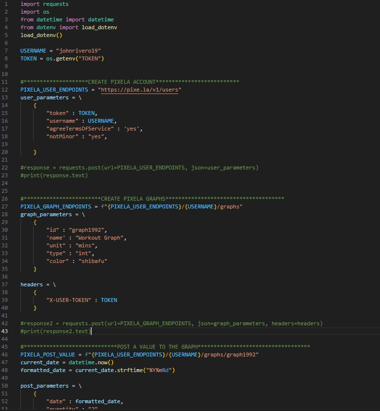
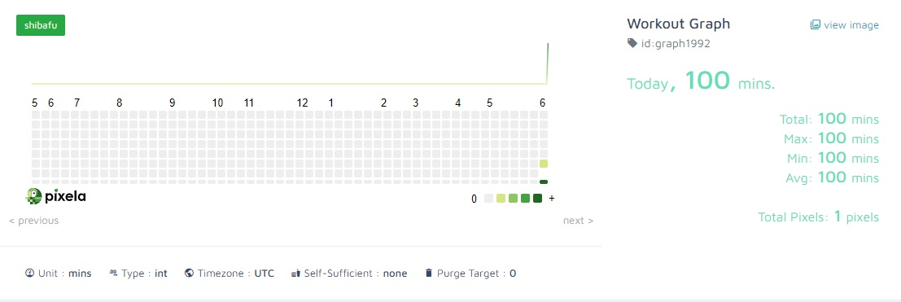

## Title: Habit Tracker 

## Program by: John Rivero

## Date: June 02, 2023

## Task

-   The Python Habit Tracker with Pixela API is a convenient and efficient project for tracking daily habits. By leveraging the Pixela API, users can create and update their habits using the POST and PUT functions. The project provides visual representations of habit data through graphs and charts, allowing users to monitor their progress over time. With the ability to view habit statistics like streaks, completions, and averages, users can gain valuable insights into their habit-forming journey. Additionally, the project offers customizable reminders to ensure consistent adherence to habits. Overall, this habit tracker simplifies habit tracking and promotes accountability.

## Code

-   Below is a screenshot of the code.

## Result

-   Below is the example of the Pixela graph.

