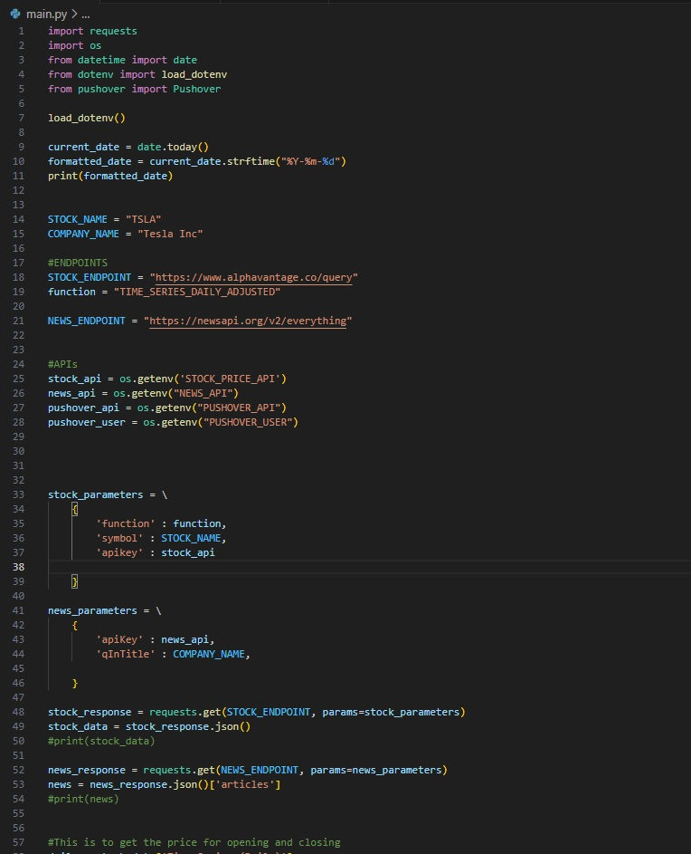

## Title: Stock Price Movement Pushover Notification

## Program by: John Rivero

## Date: June 01, 2023

## Task

-   The Stock Price Movement Pushover Notification is a Python project designed to provide real-time notifications whenever a specified stock experiences a price movement exceeding 5 percent. The project leverages various APIs to obtain stock data, including the AlphaVantage API for accessing opening and closing prices, the News API for gathering relevant news updates, and the messaging API from Pushover for delivering notifications to users.

## Code

-   Below is a screenshot of the code.

## Result

-   Below is an example of the notification from the program.

