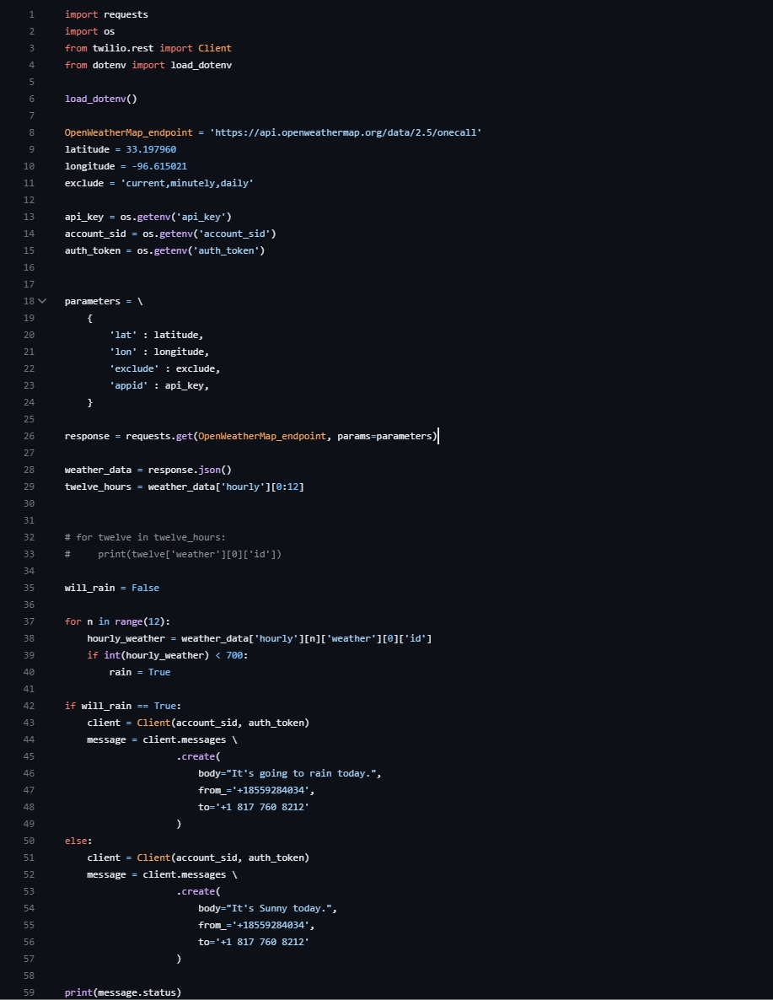

## Title: Hourly Rain SMS Notification

## Program by: John Rivero

## Date: May 25, 2023

## Task

-   This project will create a Python program that sends an automatic SMS for the next 12 hours every hour regarding whether it is sunny or if it is going to rain. The program will use the OpenWeatherMap API to get the weather forecast for the user's location. The program will then send an SMS message using Twillo's API to the targeted phone number with the forecast for the next hour.

## Code

## Result

-   Below is an example of the SMS from the program

